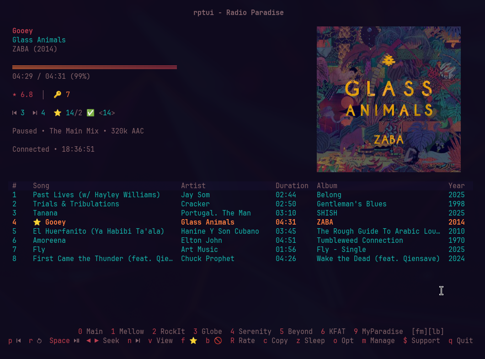
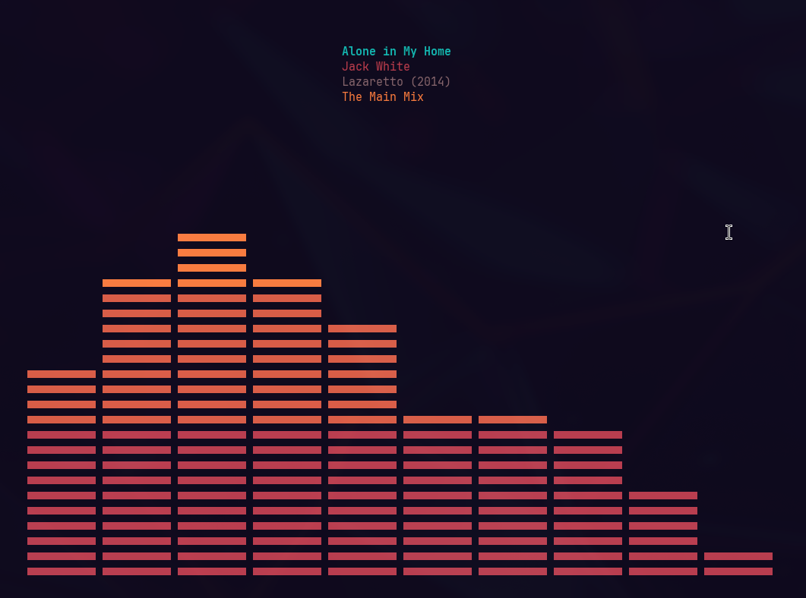

[](https://github.com/pdfrg/rptui/actions/workflows/ci.yml)

# RadioParadise TUI


### The ultimate (terminal) client for Radio Paradise

A fast, beautiful Go + Bubble Tea TUI designed for terminal lovers who want more from Radio Paradise than the official web or Android clients.

See all upcoming songs, download with a hotkey, rewind, seek, whatever you want.

If you love RP and know your way around a keyboard, it's what you've been waiting for. Give it a try!

<br>

## Why rptui?

While Radio Paradise offers the absolute best internet radio stations, human-curated and completely commercial-free, the official clients are heavy and limited, while generic internet radio players lack depth and suffer from buffering.  rptui delivers full audio file playback, beautiful visuals, real offline capability, tight Radio Paradise integration, and extensive customization in one fast, light package.

<br>




## Features

- **All RP Stations / Qualities**: Play any RadioParadise channel (Main Mix, Mellow Mix, RockIt!, The Globe, Beyond..., Serenity, KFAT) at your choice of bitrate (64k 128k 320k FLAC).
- **No Stream Buffering**: Uses the same full audio file-based playback as the official clients.
- **Skip / Previous / Seek / Restart Song**: Same functionality as provided by local music players.
- **Favorites**: Mark songs as favorites > saved to cache for later playback. Auto-queues favorites for playback when skipped ahead of livestream.  Random play favorites in jukebox mode.  Search favorites with `/`, play immediately or enqueue.
- **Blocklist**: Add songs to blocklist.  Auto-skips blocklisted songs.
- **Lyrics**: Fetch lyrics from [LRCLib](https://lrclib.net/) — plain and synced (when available).
- **Artist Info**: Smart query for artist bios and album descriptions from [TheAudioDB](https://www.theaudiodb.com/), [Discogs](https://www.discogs.com/), and Wikipedia.
- **Artist Images**: Smart query for artist thumbnails and image galleries from Discogs (requires user token) and TheAudioDB (no token required).
- **Artist Discographies**: All official studio albums from [MusicBrainz](https://musicbrainz.org/)
- **Album Art**: Smart terminal support via [go-termimg](https://github.com/blacktop/go-termimg) (Kitty, iTerm2, Sixel, Unicode fallback).  Terminals with Kitty image protocol support recommended (Kitty, Ghostty, and Rio all work perfectly).
- **Visualizations**: 9 real-time audio visualizations (bars, braille, braille bars, wave, rain, stars, binary, segmented, classic peak).  Full terminal window toggle, true fullscreen when terminal maximized.
- **Scrobbling**: [Last.fm](https://www.last.fm/) and [ListenBrainz](https://listenbrainz.org/) support.
- **Themes**: Automatic current Omarchy theme detection with live-reloads, 6 built-in themes, and custom colors.toml support.  Smart parsing of Omarchy themes for optimum color choices (tested on 70 themes).  Option to disable theme background or themes entirely to use your own terminal palette.
- **Jukebox Mode**: Random play all favorites, optional re-shuffle and repeat all for endless playback.  Works offline.
- **Offline Mode**: Cache any station for any duration.  Playback anytime, even while offline.  Album art included.
- **Network Status Handling**: Smart prompts offer to change modes when network change detected, so that music keeps playing. 
- **Desktop Integration**: MPRIS metadata, media key support, desktop notifications with optional album art, save album art to file for desktop widget use.
- **Lidarr Integration**: Love something you heard on RP? Easily add to your own library with Lidarr! Just press `L` to open the artist in Lidarr. If already in your library, opens their artist page. If not, opens "Add New Artist" for your confirmation (nothing is added automatically).
- **Four Smart Layouts**: `large` (default, full dashboard with multiple bottom views available), `medium`, `compact`, and `narrow` (perfect vertical sidebar).
- **Terminal Size Detection**: Warns if current terminal is too small for layout chosen, gives recommended size and alternate layouts(s) which fit in current terminal, allows to force fit if desired. User is always in control.
- **Keyboard Navigation**: Hotkeys and RP stations shown in footer. Change stations with a single keypress.
- **Sleep Timer / Alarm**: Fall asleep or wake up to the sounds of RP.
- **DJ Speech Skipping**: Automatically detect and skip DJ interludes using a TVSM neural network. Configurable confidence threshold and boundary check. Optional one-time setup downloads the model.

## RP Account Support
- **Ratings**: Displays all your user ratings.  Submit ratings (1-10), just as in the official clients.
- **Comments**: Show song comments.  Loads 20 comments at a time with pagination.
- **My Paradise**: Appears as an additional station.  Stream all songs above rating threshold (set in RP account, default 7+) without need to download.
- **Auto-Download Favorites**: Configurable setting (default = false).  Grabs all songs with user rating above threshold when they appear on the RP playlist.
- **Auto-Add to Blocklist**: Configurable setting (default = false).  Auto-skip all songs with user rating below configurable threshhold (default <4).

## Screenshots

**Full-Window Visualizer**


rptui offers four unique layouts and multiple views (playlist, lyrics, synced lyrics, artist info, artist image gallery, song comments, visualizer, and full-window visualizer).
See [SCREENSHOTS.md](SCREENSHOTS.md) for the full gallery, including all built-in themes.

## Installation

### Prerequisites

- **mpv** — Required for audio playback
- **Go 1.22+** — To build from source
- **Any NerdFont** — For proper display of symbols

### Recommended Dependencies (Linux)

- **mpv-mpris** — MPRIS support for media keys and desktop integration
- **notify-send** — Desktop notifications on song changes with optional album art

### Visualizer Dependencies (MacOS, Optional)

The audio visualizer requires platform-specific audio capture tools:

| Platform | Tools | Notes |
|----------|-------|-------|
| **Linux** | PipeWire or PulseAudio | Built in |
| **Windows** | WASAPI | Built in |
| **macOS** | SoX + BlackHole | Install via Homebrew |

#### MacOS Setup

MacOS requires additional setup to capture system audio for the visualizer:

```bash
brew install sox blackhole-2ch
```

Then configure in **Audio MIDI Setup** (Applications → Utilities):

1. Click **+** → **Create Multi-Output Device**
2. Check: **BlackHole 2ch** and your speakers/headphones
3. Go to **System Settings → Sound → Output**
4. Select the Multi-Output Device

All system audio is now routed through BlackHole and can be captured for the visualizer. Volume control may be disabled (normal for Multi-Output Device).

Without these tools, MacOS falls back to simulated visualizer mode.

### Quick Installation (Linux, Windows, or MacOS)

NOTE: Windows and MacOS support is considered experimental and untested.
Feedback, fixes, or improvements would be greatly appreciated.

```bash
# Recommended: install via Go
go install github.com/pdfrg/rptui/cmd/rptui@latest
```
### Build from Source

```bash
git clone https://github.com/pdfrg/rptui.git
cd rptui
go build -o rptui ./cmd/rptui
```

Both `go install` and `go build` work for basic usage. See [DOCUMENTATION.md](DOCUMENTATION.md) for optional scrobbling setup.

Pre-built binaries for Linux, Windows, and MacOS with Last.fm support baked-in are downloadable from releases. Only a Last.fm user account is required. See DOCUMENTATION.md / Scrobbling for details.

## Terminal Compatibility

The included themes are designed and tested primarily on modern GPU-accelerated terminals (Kitty, Ghostty, and Rio on Arch-based systems). These give the cleanest, most polished look.
On non-GPU-accelerated terminals, especially the default terminals shipped with Debian/Ubuntu derivatives and MATE/GNOME desktops (mate-terminal, gnome-terminal, and similar VTE-based terminals), the themed background and color overrides can sometimes render incorrectly, especially when the terminal is configured with background transparency.
To make the app look great on any Linux terminal, use these config options:

`transparent_background = true`  Turns off the app’s own background theming and uses your terminal’s native background instead.

`disable_theme = true`  Completely disables themes and falls back to your terminal’s built-in palette (colors 0-15). You can still tweak individual colors if you want.

These two config settings were added specifically so the app looks great everywhere. Just pick whichever looks better in your terminal.
To see the effects of terminal transparency settings, and of enabling these options, please see [SCREENSHOTS.md](SCREENSHOTS.md).

Recommendation: For the best overall experience (best image support, full theme compatibility), use a modern terminal like Kitty, Ghostty, or Rio.
However, these are absolutely NOT required.  The config options guarantee a clean, usable interface on the default Ubuntu/MATE terminal, xfce4-terminal, or any other emulator.

## Attribution

DJ speech detection: [TVSM-dataset](https://github.com/biboamy/TVSM-dataset) — TVSM CRNN neural network for speech detection in music.

Audio visualizations: [cliamp](https://github.com/bjarneo/cliamp). Awesome music player with retro Winamp style in the terminal.

## Documentation

For detailed configuration options and advanced usage, see [DOCUMENTATION.md](DOCUMENTATION.md).

## Support

If you enjoy listening to Radio Paradise, please consider [supporting them](https://radioparadise.com/donate).

## License

MIT
